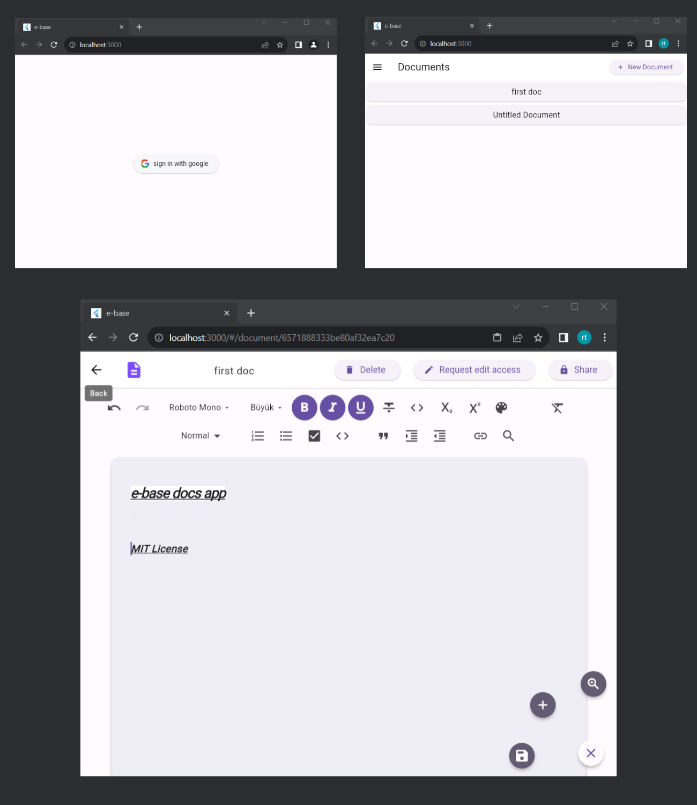

# e-base File Editing Web App (Flutter/Dart)
## Tech. I use :
### -Node.js, -Socket.io(for real-time changes) -Express.js, -MongoDB, -Flutter/Dart, -Quill, -Riverpod.
## Before start :
#### -Change the api url in the constants.dart file to your api url.

#### -Run this command in the terminal to get the dependencies: 'flutter pub get'.

#### -Run this command in the terminal to launch project: 'flutter run -d chrome --web-port 3000'.

#### -Add your own MongoDB url link mine will not work.

#### -And make sure the quill package is up-to-date.

 

For more help please contact me on my email: malkoceren24@gmail.com

 
